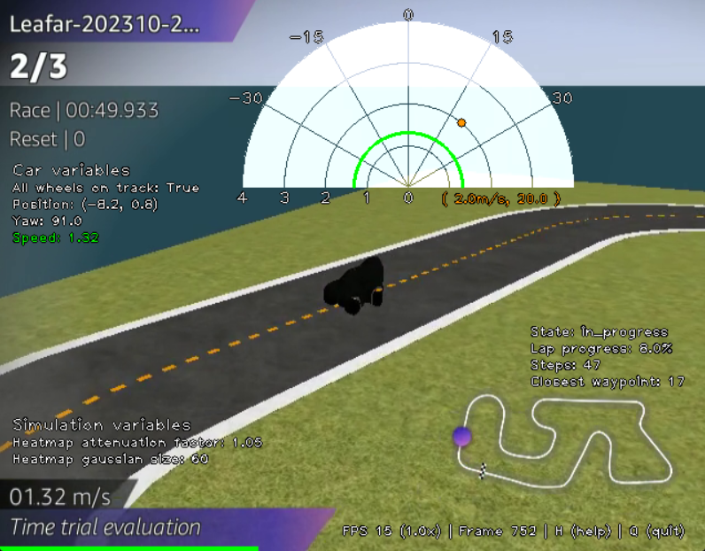

# aws-deepracer-analyzer
This repo provides a tool for analyzing AWS DeepRacer runs.

## Table of Contents
1. [Features](#features)
    - [Car and track variables](#car-and-track-variables)
    - [Action space](#action-space)
    - [Reward function components](#reward-function-components)
    - [Simulation control](#simulation-control)
    - [Recording the simulation](#recording-the-simulation)
2. [Setup](#setup)

4. [Other analysis resources](#other-analysis-resources)

It provides useful information overlaied on top of the video presented during training or evaluation. This is useful especially to identify the most common actions the car takes, in order to adjust its action space.

## Analysis features

### Car and track variables
All car and track variables that evolve during the corse of the lap are overlayed on screen.

- Car variables: X-Y position, yaw, all_wheels_on_track, and speed (also shown on the [action space polar graph](#action_space_speed)).
- Lap variables: lap state (prepare, in_progress, off_track, pause, lap_complete), lap progress, steps, closest waypoint.

The speed of the car is not provided in the logs and the throttle is not a good indicator of speed. Initially, I tried calculating it using the X-Y displacement per unit of time, but that didn't work well.
The current implementation is to read the video stream which indicates the speed of the car at each frame on the lower-left corner. Before running the simulation, an OCR algorithm is run on the entire video and the speed values are added to the logs. This process takes a few minutes but only requires being run once per model log; on subsequent runs it automatically detects that the speed has been added already.

### Action space
Choosing the appropriate action space is an important step in defining our car model. Too restrict of an action space may lead to sub-optimal performance, not allowing the car to perform specific actions like turning at a sharp angle or put the pedal to the metal. A broad action space gives much more freedom for the model to find its optimal set of actions but increases the training time and cost.

I have many times found myself watching an evaluation run and wondering what steering angle and throttle the car was using at the tighest corner, so that I could then restrict the action space to that maximum needed angle and minimum throttle.
But instead of wondering, we can see it with a simple action space overlay shown at the top of the simulation:

The polar graph shows the entire allowed action space with steering angles from -30º to 30º and throttling from 0m/s to 4/ms.
The current action chosen by the model is indicated in orange both by a dot on the polar graph and written  below it. In the image above the action is (2.0m/s, 20.0º), meaning the car is turning at 20º to the right and throttling at 2.0m/s.

The current speed of the car (not to confuse with the throttle), written in green in the list of car variables on the left, is also shown graphically on the polar graph with a green semi-circle.

 

On top of the polar graph, a heatmap can be overlayed to cluster the actions from the last few seconds. This is useful to understand the strategy of the model on specific situations like on curves and straight lines.
In the image below, for example, the car has just performed a 180º right turn and with the heatmap we see the car mostly chose to turn at a speed of 2m/s with steering angles of 20º and 30º.
We could take this information and tweak the [reward function](#reward-function-components) to make it go faster on a curve

### Reward function components
The __reward function__ is a core component of your model responsible for incentivizing or penalizing the model for the actions taken, thus teaching it how to act for a specific state of the race.

Coming to a good reward function is a highly iterative process. Usually it's a good idea to start with simple reward functions and tweak it from there.

Let's say we start with a reward function that incentivizes _speed_, making the reward equal to the speed squared.
As we analyze an evaluation run after training we might realize that the car is choosing to make the turns on the outer side of the curve, increasing the time on track and thus the overall reward. But that's not what we want. Instead we want the car to finish the race in the shorted time possible.
So, we introduce a _progress_ component which incentivizes the track progress in the least possible steps.
We might also notice that the car often goes off track on a tight corner and so we add a penalizing factor everyime that happens.

Combining these and other reward factors cannot be done naively or they might not yield good results. If one component is much higher than the rest, the smaller rewards might not be considered at all. Therefore, they must be normalized or weighted according to the importance we want to give them during training. Plotting each of the reward components helps on that.

This feature is also good to just play around and see how different component functions vary as the car goes along the track. 

We can add as many reward components to our analysis as need, as long as the variables we need to calculate the components are available in the logs (_speed_ is not included in the logs, but can also be used as explained [here](#get_speed_ocr)).

### Simulation control

Various aspects of the simulation can be tuned to the user's preference.
A help menu, accessible by pressing __H__, displays the available commmands.

<!-- - Pause and move frame-by-frame analysis
- Easily jump to any moment of the race with keys 0-9
- Increase/decrease speed of simulation controling the frames per seconds.
- Total progress bar at the bottom. -->

### Recording the simulation

Record the simulation by pressing __R__. Press __R__ again to stop and save it as an MP4 file in the model folder.

A recording status is shown like below:

## Setup
To run simulation locally, follow the steps below:

1. Clone this repository locally
2. Evaluation logs
    - Download the evaluation logs from the AWS DeepRacer console.
    - Unzip the logs into _/car_models/<your_model_folder>/_.
3. Evaluation video
    - Download the evaluation video from the AWS DeepRacer console by right-clicking the video and saving it as an MP4 file in _/car_models/<your_model_folder>/_.

4. Notebook script
    - Change the necessary path variables at the beginning of the notebook.
    - Make sure you install all necessary Python dependencies for the imports at the top of the notebook.
    - Execute all cells. A new window with the simulation should pop up. Press __H__ any time for the list of commands, and __Q__ to stop the simulation.

## Other analysis resources
Another commonly used log analysis tool can be found here: https://github.com/aws-deepracer-community/deepracer-analysis