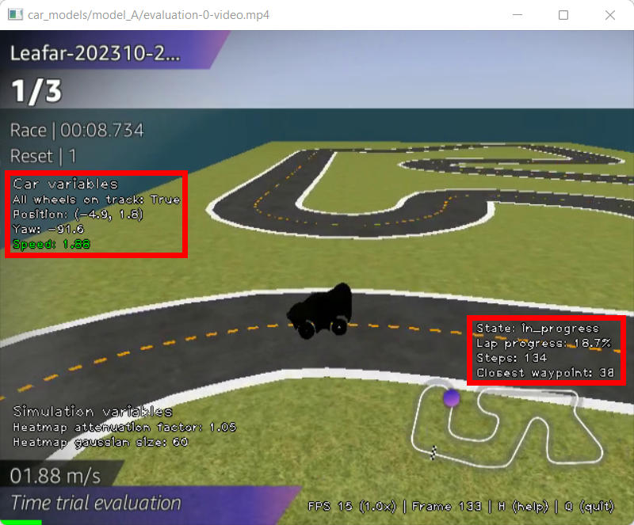
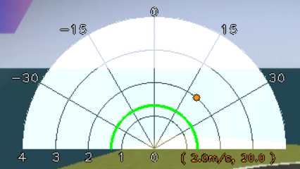
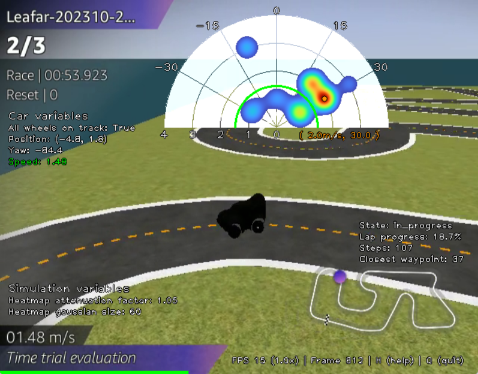
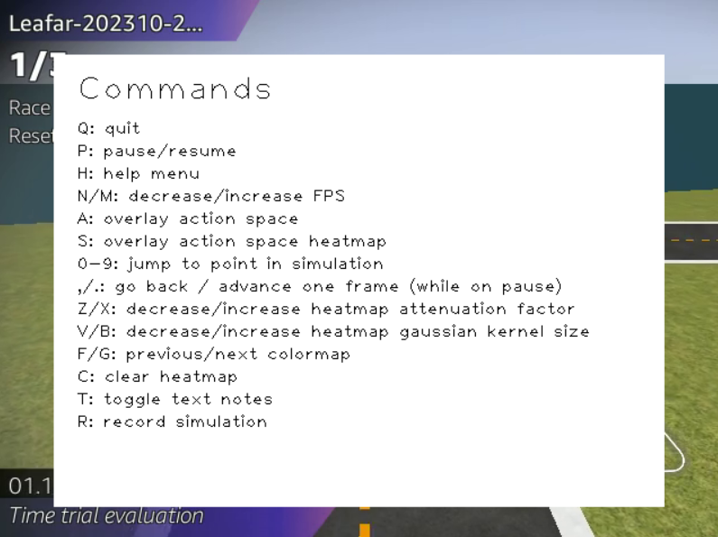
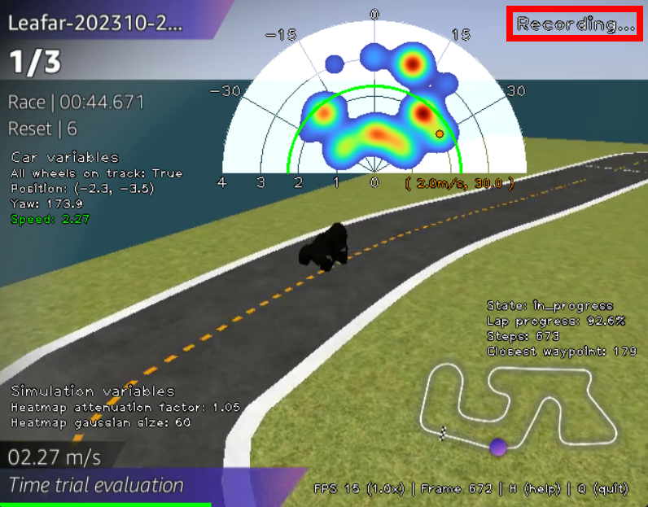
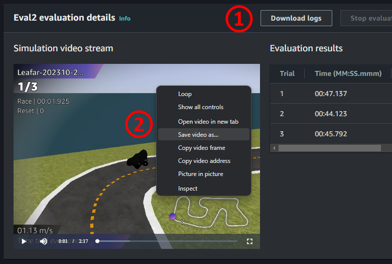

# AWS DeepRacer Analyzer
This repo provides a tool for analyzing AWS DeepRacer runs.

## Table of Contents
1. [Features](#features)
    - [Car and track variables](#car-and-track-variables)
    - [Action space](#action-space)
    - [Reward function components](#reward-function-components)
    - [Simulation control](#simulation-control)
    - [Recording the simulation](#recording-the-simulation)
2. [Setup](#setup)

## Analysis features

### Car and track variables
All car and track variables that evolve during the corse of the lap are overlayed on screen.

- Car variables: X-Y position, yaw, all_wheels_on_track, and speed.
- Lap variables: lap state (prepare, in_progress, off_track, pause, lap_complete), lap progress, steps, closest waypoint.

### Action space
Choosing the appropriate action space is an important step in defining the car model.

Too restrict of an action space may lead to sub-optimal performance, not allowing the car to perform specific actions like turning at a sharp angle or put the pedal to the metal. A broad action space gives much more freedom for the model to find its optimal set of actions but increases the training time and cost.

The polar graph shows the entire allowed action space with steering angles from -30º to 30º and throttling from 0m/s to 4/ms.
The current action chosen by the model is indicated in orange both by a dot on the polar graph and written  below it. In the image above the action is (2.0m/s, 20.0º), meaning the car is turning at 20º to the right and throttling at 2.0m/s.

On top of the polar graph, a heatmap can be overlaid to cluster the actions from the last few seconds. This is useful to understand the strategy of the model on specific situations like on curves and straight lines.
In the example below the car has just performed a 180º right turn and with the heatmap we see the car mostly chose to turn at a speed of 2m/s with steering angles between 20º and 30º.

### Reward function components
Reward functions are a core component of any model responsible for incentivizing or penalizing it for the actions taken, effectively teaching the agent how to act for a specific state of the race.

Reward factors cannot be combined naively or the training may not yield good results. If one component is much higher than the rest, the smaller rewards might not be considered at all. Therefore, they must be normalized or weighted according to the importance we want to give them during training.
Plotting each of the reward components helps compare their amplitudes and adjust for major discrepancies:

We can add as many reward components to our analysis as need, as long as the variables we need to calculate the components are available in the logs (_speed_ is not included in the logs, but can also be used).

### Simulation control

Various aspects of the simulation can be tuned to the user's preference.
A help menu, accessible by pressing __H__, displays the available commmands.

The simulation can be paused and advanced frame-by-frame or we can jump to other parts of the track using the numerals 0 through 9.

For the action space heatmap, both the kernel size, attenuation factor, and colormap can be adjusted.

### Recording the simulation

Record the simulation by pressing __R__. Press __R__ again to stop and save it as an MP4 file in the model folder.
The simulation run, the variables, and the action space are all captured.

A recording status is shown like below:

## Setup
To run simulation locally, follow the steps below:

1. Clone this repository locally
2. Evaluation logs
    - Download the evaluation logs from the AWS DeepRacer console.
    - Unzip the logs into _/car_models/<your_model_folder>/_.
3. Evaluation video
    - Download the evaluation video from the AWS DeepRacer console by right-clicking the video and saving it as an MP4 file in _/car_models/<your_model_folder>/_.

4. Notebook script
    - Change the necessary path variables at the beginning of the notebook.
    - Make sure you install all necessary Python dependencies for the imports at the top of the notebook.
    - Execute all cells. A new window with the simulation should pop up. Press __H__ any time for the list of commands, and __Q__ to stop the simulation.
